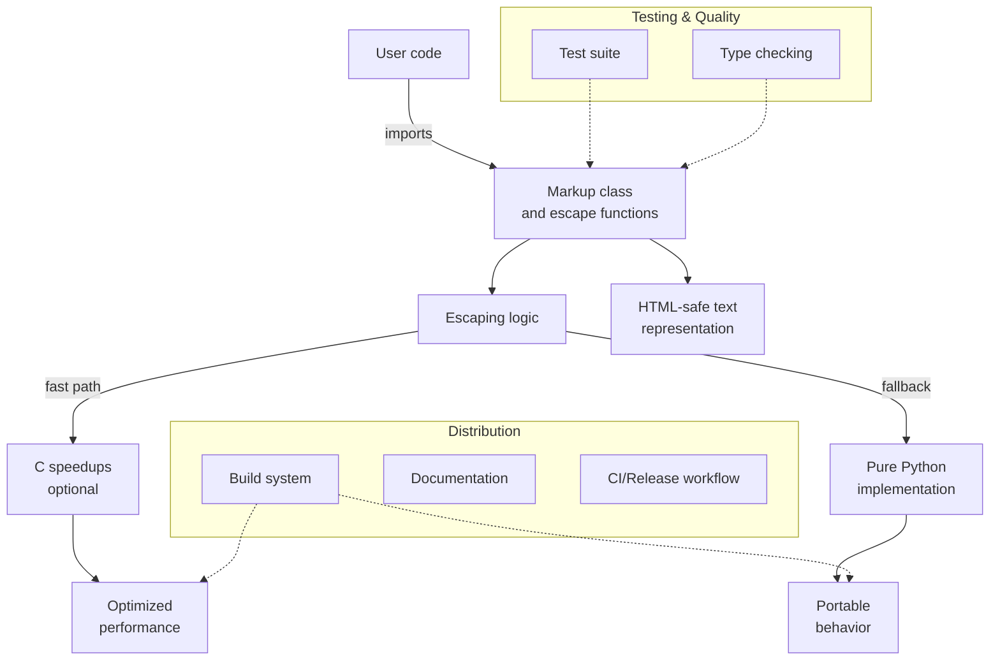

# Overview

<!-- Maintained by Tidewiki. Edits are kept on later updates; wrap text in tidewiki:keep markers to freeze it. -->

MarkupSafe is a Python library that safely handles untrusted user input in HTML and XML contexts. It implements the [markup-class](markup-class.md) core `Markup` class, which represents text that is safe to include in markup, and provides [escaping](escaping.md) escaping functions that convert special characters to their HTML entity equivalents. This approach mitigates injection attacks by ensuring that user-supplied strings cannot break out of their intended context.

The library is in production use and [`pyproject.toml:10`](../../pyproject.toml#L10) rated as "Production/Stable". It supports Python 3.10 and later.

## What it does

[`README.md:5-9`](../../README.md#L5-L9) MarkupSafe implements a text object that escapes characters so it is safe to use in HTML and XML. Characters that have special meanings are replaced so that they display as the actual characters. This mitigates injection attacks, meaning untrusted user input can safely be displayed on a page.

For example [`README.md:14-32`](../../README.md#L14-L32), the `escape()` function converts `` to `Markup('&lt;script&gt;alert(document.cookie);&lt;/script&gt;')`. The `Markup` class itself is a string subclass where methods like `format()` automatically escape their arguments, so you can safely interpolate untrusted data into templates.

## Building blocks

- **[Markup Class](markup-class.md)**: The core `Markup` class represents HTML-safe text. It is a `str` subclass where string methods and operators automatically escape their arguments to prevent injection.

- **[Escaping and Safety](escaping.md)**: Escaping functions convert special characters (`<`, `>`, `&`, `"`, `'`) to HTML entities. This is the fundamental mechanism that prevents untrusted input from breaking markup structure.

- **[Performance Optimizations](speedups.md)**: A C extension module provides optimized versions of critical escaping functions, significantly improving performance for large text operations. Falls back to pure Python if the extension is unavailable.

- **[Testing and Quality Assurance](testing.md)**: Comprehensive test suite ensures escaping behavior, memory safety, `Markup` functionality, and exception handling are correct and secure.

- **[Documentation](documentation.md)**: Sphinx-based documentation system that generates user guides and API documentation.

- **[Packaging and Build](packaging-and-build.md)**: Build configuration using setuptools, supporting both pure Python and native C extension distribution.

- **[CI and Release Workflow](ci-and-release.md)**: Automated testing, building, and publishing to PyPI via GitHub Actions.

- **[Development Environment](development-setup.md)**: Tools and configuration for local development, including linting (ruff), type checking (mypy, pyright), and test execution.

## Getting started

To run the project locally, set up a development environment as described in [Development Environment](development-setup.md). The project uses [`pyproject.toml:63-64`](../../pyproject.toml#L63-L64) `uv` as the package manager, with development dependencies specified in `pyproject.toml`.

Common tasks:
- Run tests: `tox` (or `pytest` directly)
- Run type checkers: `tox -e typing`
- Build documentation: `tox -e docs` or `tox -e docs-auto` for live reload
- Run linting: `tox -e style`

See [CI and Release Workflow](ci-and-release.md) for how releases are automated.
